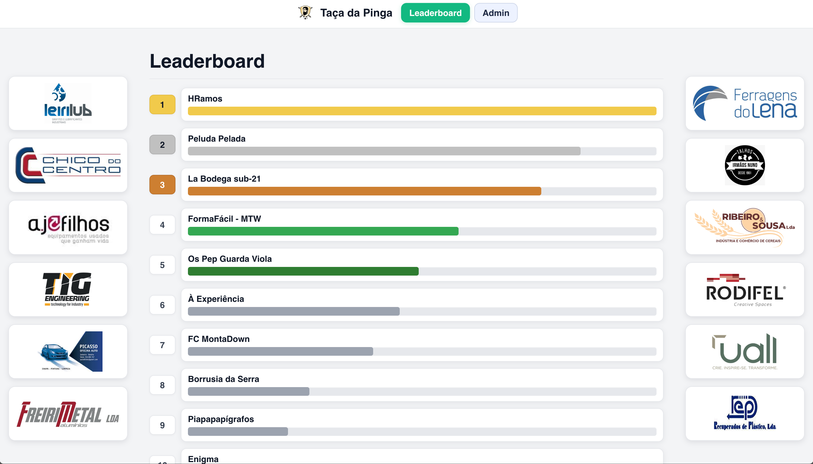
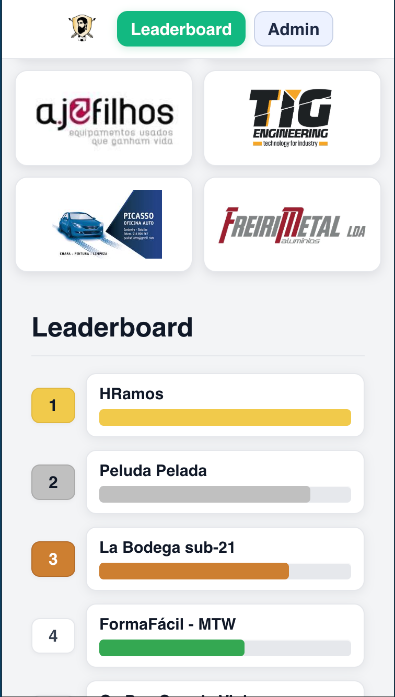
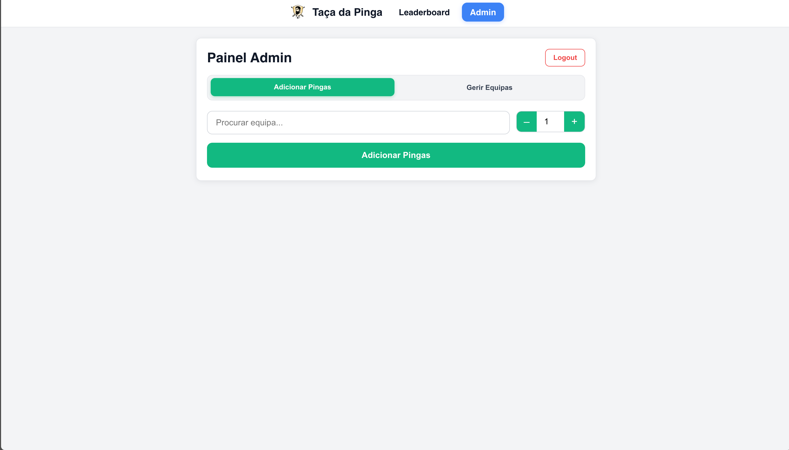
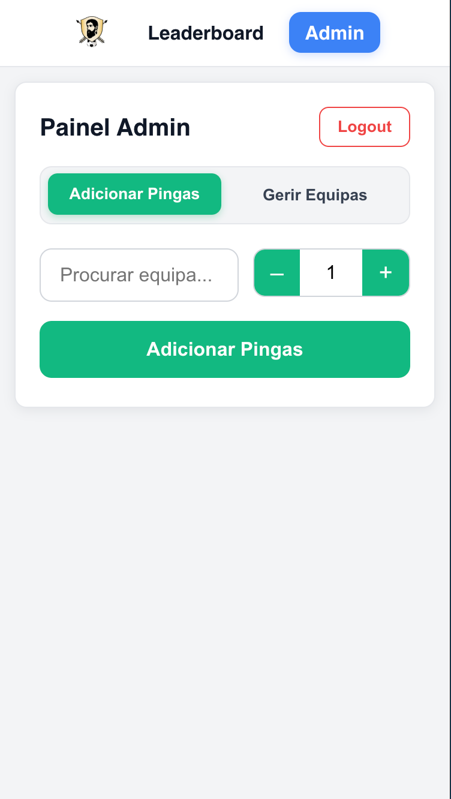
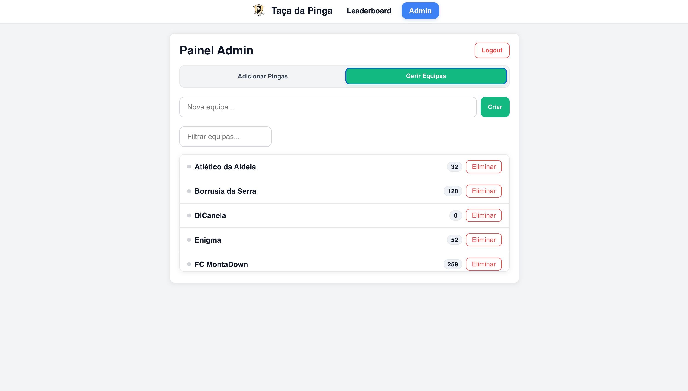
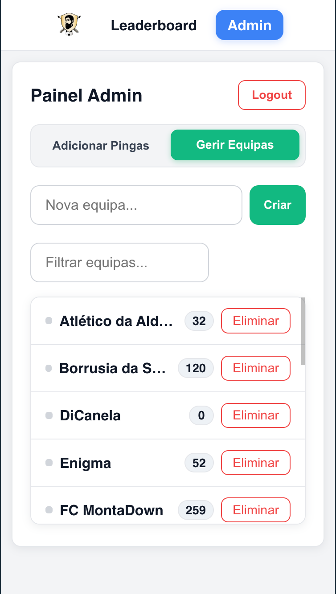

# 🏆 Taça da Pinga

> Real-time leaderboard app for a friendly football tournament — with beer points instead of goals 🍺

[](https://react.dev/)[](https://firebase.google.com/)[](https://recharts.org/)[](https://github.com/css-modules/css-modules)


[](/LICENSE)

A small web application built with **React** and **Firebase** to manage a fun "beer points" leaderboard for a local football tournament.  
Participants can see the leaderboard in real-time, and admins can add points (_pingas_) from a protected admin panel.

Originally developed in a couple of days as a request for a friend, this project also served as a hands-on opportunity to practice **React** development, **Firebase** integration, and responsive UI design.

🚀 <a href="https://taca-da-pinga.web.app/" target="_blank"><strong>Click here to view the live demo</strong></a> 🚀

---

## ✨ Features

- **Real-time Leaderboard** – Updates instantly as scores change.
- **Admin Panel** – Secure login for managing teams and adding points.
- **Responsive Design** – Optimized for desktop, TV display, and mobile.
- **Firebase Integration** – Authentication & Firestore database.
- **Sponsor Rail** – Displays tournament sponsors.

---

## 📸 Screenshots

### Leaderboard

| Desktop View                                              | Mobile View                                              |
| --------------------------------------------------------- | -------------------------------------------------------- |
|  |  |

### Admin

#### Add Pingas

| Desktop View                                      | Mobile View                               |
| ------------------------------------------------- | ----------------------------------------- |
|  |  |

#### Manage Teams

| Desktop View                                          | Mobile View                                   |
| ----------------------------------------------------- | --------------------------------------------- |
|  |  |

---

## 🛠️ Tech Stack

- **Frontend:** React, CSS Modules
- **Backend:** Firebase (Firestore, Authentication)
- **Hosting:** Firebase Hosting
- **Other Tools:** Recharts (for the leaderboard bars)

---

## 📂 Project Structure

```
.
├──📁 public/ # Static assets
├──📁 src/ # Main source code
│ ├──📁 assets/ # Images, SVGs
│ ├──📁 components/ # Reusable UI components
│ ├──📁 pages/ # Page-level components
│ ├──📄 firebase.js # Firebase configuration (uses .env variables)
│ └──📄 globals.css # Global styles
├──📄 .env.example # Example environment variables
└──📄 package.json # Dependencies & scripts
```

---

## ⚙️ Environment Variables

Before running the project locally, create a `.env` file in the root directory based on [.env.example](.env.example) and fill in your Firebase configuration details.:

```env
REACT_APP_FIREBASE_API_KEY=your_api_key
REACT_APP_FIREBASE_AUTH_DOMAIN=your_auth_domain
REACT_APP_FIREBASE_PROJECT_ID=your_project_id
REACT_APP_FIREBASE_STORAGE_BUCKET=your_storage_bucket
REACT_APP_FIREBASE_MESSAGING_SENDER_ID=your_sender_id
REACT_APP_FIREBASE_APP_ID=your_app_id
```

---

## 🚀 Getting Started

#### Prerequisites

- Node.js v18+
- npm (comes with Node)

#### Installation

```
# Clone the repository
git clone https://github.com/OFranjas/taca-da-pinga.git

# Install dependencies
npm install
```

#### Development

```
npm start
```

Runs the app in development mode at http://localhost:3000

#### Build

```
npm run build
```

Builds the app for production to the `build` folder.

## 🔀 Branching Model

- `feature/*` → short-lived feature branches, branched from `develop`
- `develop` → integration branch (feature PRs merge here)
- `production` → production-ready branch (protected)

### PR Rules

- Into `develop`: CI must be green.
- Into `production`: CI must be green **and** at least 1 approval from code owner.
- Required CI check name: **CI / Lint / Typecheck / Test / Build**

See [`AGENTS.md`](./AGENTS.md) for exact agent/developer workflows.

---

## Runbook

- Local dev: [docs/DEV.md](docs/DEV.md)
- Config/env: [docs/CONFIG.md](docs/CONFIG.md)
- Testing: [docs/TESTING.md](docs/TESTING.md)
- Release: [docs/RELEASE.md](docs/RELEASE.md)
- Security: [docs/SECURITY.md](docs/SECURITY.md)

## 📄 License

This project is licensed under the MIT License. Check the [LICENSE](./LICENSE) file for more details.

## ⚠️ Disclaimer

This project was created as a lightweight, fun leaderboard system for a friendly competition.
Some logos and assets are used for demonstration purposes only and may be subject to copyright or restricted use.
