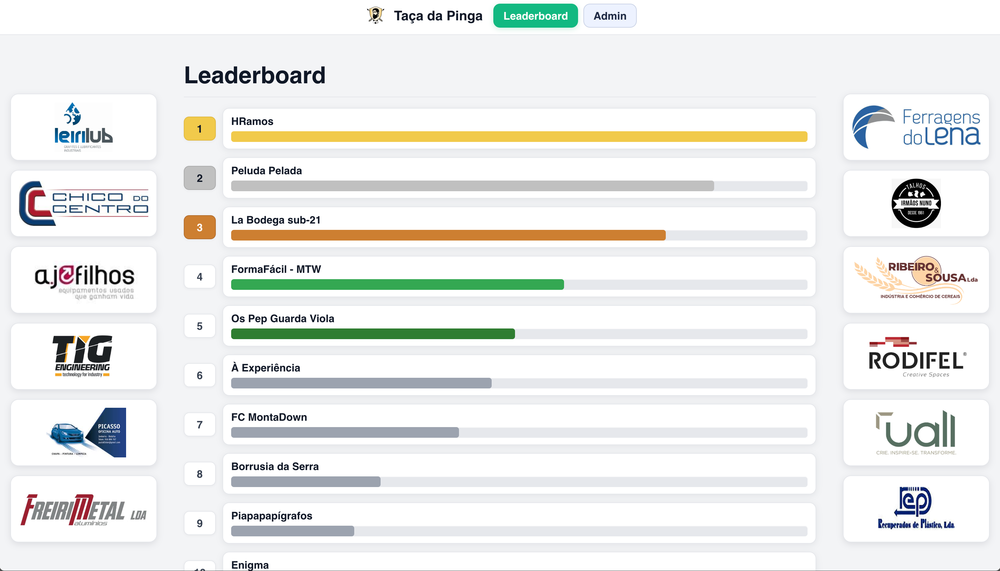
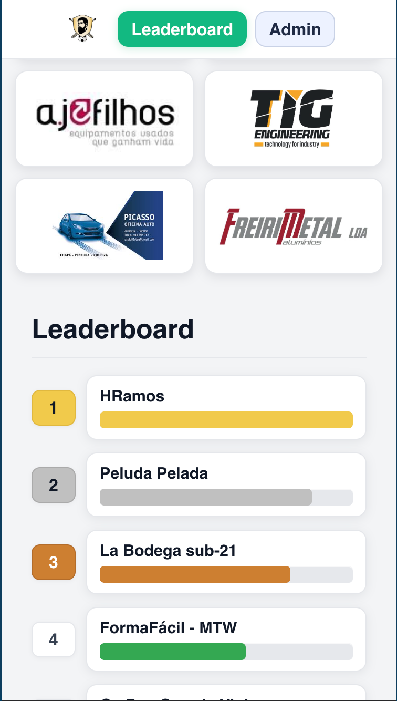
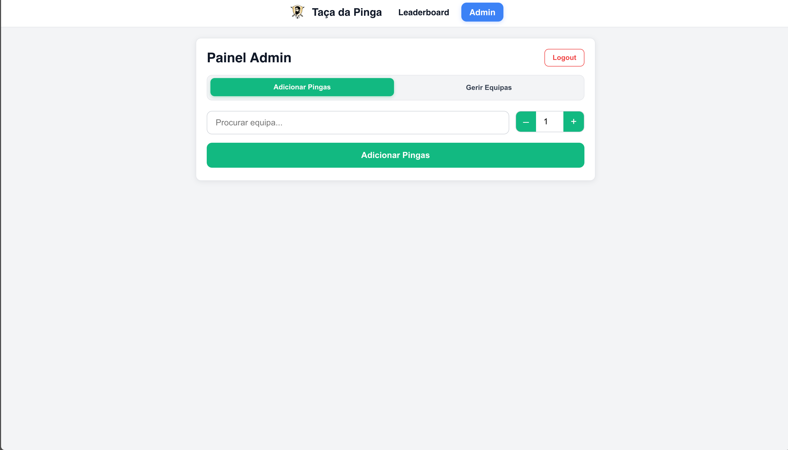
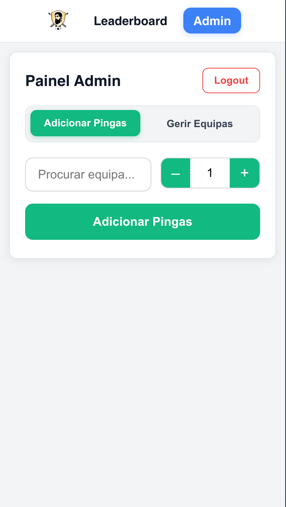
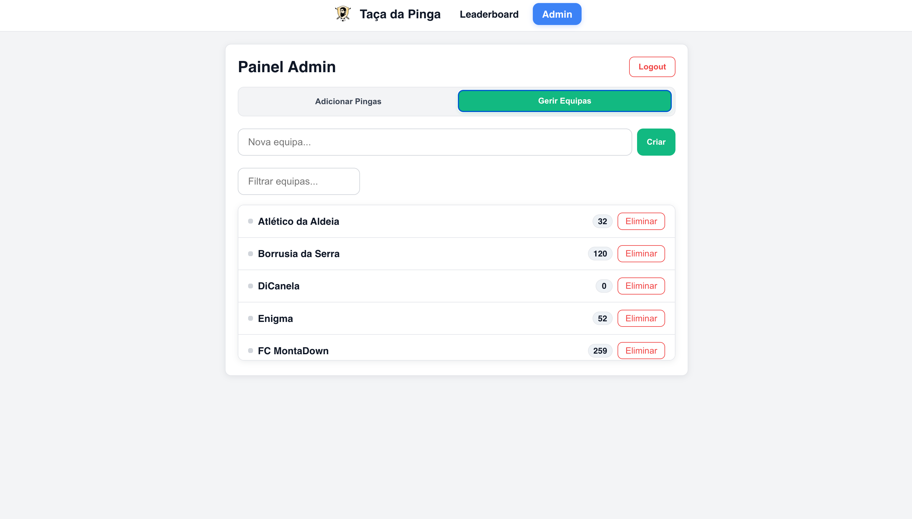
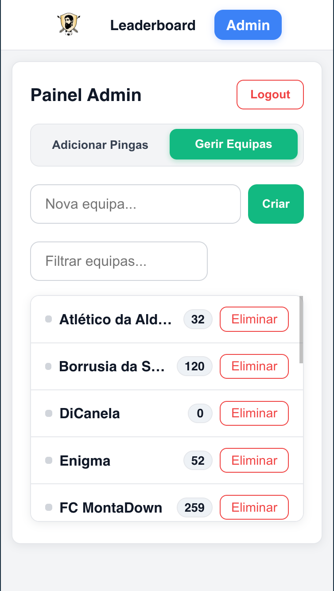

# 🏆 Taça da Pinga

> A real-time tournament leaderboard for tracking drinks as **pingas** 🍺

[](https://react.dev/)[](https://firebase.google.com/)[](https://recharts.org/)[](https://github.com/css-modules/css-modules)


[](/LICENSE)

A React and Firebase app for live tournament scoring. Visitors can follow the leaderboard without signing in; authorised administrators manage teams, score configured drinks, update tournament branding and manage sponsor placements.

**Live site:** [taca-da-pinga.web.app](https://taca-da-pinga.web.app/)

---

## ✨ Features

- **Live leaderboard** – Teams update immediately as scores are recorded, with responsive comparison bars.
- **Drink scoring** – Admins record configured drinks; the app derives the pinga total and preserves a per-drink breakdown.
- **Admin tools** – Create and manage teams, edit sponsors, and update the tournament logo and icon.
- **Display mode** – A presentation-focused `/display` route for a TV or shared screen.
- **Sponsor rails** – Accessible, motion-aware sponsor presentation across desktop, display and mobile layouts.
- **PWA support** – Installable app shell and service worker for a more app-like tournament experience.

See [the admin guide](docs/ADMIN.md) for the operational workflow and [the drinks catalogue](docs/CONFIG.md#developer-owned-drinks-catalogue) for the currently configured scores.

## Routes

| Route                 | Purpose                                                  | Access     |
| --------------------- | -------------------------------------------------------- | ---------- |
| `/`                   | Tournament home and sponsor presentation                 | Public     |
| `/leaderboard`        | Interactive live leaderboard                             | Public     |
| `/display` (or `/tv`) | Presentation-first leaderboard for a TV or shared screen | Public     |
| `/admin`              | Scoring, teams and sponsor management                    | Admin only |
| `/admin/branding`     | Logo and icon management                                 | Admin only |

The service worker is registered only in production builds. It caches the app shell for installation and faster repeat visits, but live Firebase data still requires a network connection.

---

## 📸 Screenshots

### Leaderboard

| Desktop View                                              | Mobile View                                              |
| --------------------------------------------------------- | -------------------------------------------------------- |
|  |  |

### Admin

#### Add Pingas

| Desktop View                                      | Mobile View                               |
| ------------------------------------------------- | ----------------------------------------- |
|  |  |

#### Manage Teams

| Desktop View                                          | Mobile View                                   |
| ----------------------------------------------------- | --------------------------------------------- |
|  |  |

---

## 🚀 Getting Started

#### Prerequisites

- Node.js v22.19.0 (see `.nvmrc`)
- Corepack (bundled with Node 22; run `corepack enable`)

#### Installation

```
# Clone the repository
git clone https://github.com/OFranjas/taca-da-pinga.git

# Enable Corepack and install deps
corepack enable
yarn install
```

#### Development

```
yarn dev
```

Runs the app in development mode (Vite) at http://localhost:5173 with HMR.

#### Build

```
yarn build
```

Builds the app for production to the `dist` folder (Vite). Use `yarn preview` to locally preview the production build.

#### Testing

```
yarn test        # unit + component (Vitest)
yarn test:ci     # CI mode with coverage
yarn test:rules  # Firestore security rules (emulator)
yarn lint        # lint source files
yarn typecheck   # TypeScript checks
yarn build       # production build
```

## 🔀 Branching Model

- `feature/*` → short-lived feature branches, branched from `develop`
- `develop` → integration branch (feature PRs merge here)
- `production` → production-ready branch (protected)

### PR Rules

- Into `develop`: CI must be green.
- Into `production`: CI must be green **and** at least 1 approval from code owner.
- Required CI check name: **CI / Lint / Typecheck / Test / Build**

### CI & Deployments

- **PR Preview** – Every pull request builds the app in GitHub Actions and publishes a Firebase Hosting preview at [`https://preview-taca-da-pinga.web.app`](https://preview-taca-da-pinga.web.app). The job reuses the preview channel, so reruns refresh the same URL.
- **Deploy Develop** – Merges to `develop` rerun lint/test/typecheck/build and deploy the bundle to the dedicated Hosting site [`https://develop-taca-da-pinga.web.app`](https://develop-taca-da-pinga.web.app).
- Both workflows require the Firebase web config secrets (`VITE_FIREBASE_*`) and a `FIREBASE_SERVICE_ACCOUNT` with Hosting + Rules deploy permissions. See [docs/CONFIG.md](docs/CONFIG.md#github-secrets) for the list.

See [`AGENTS.md`](./AGENTS.md) for exact agent/developer workflows.

---

## Firestore Emulator

Security rules tests run against the Firestore emulator. The `yarn test:rules` script automatically downloads and starts the emulator before executing the tests.

If you prefer to keep the emulator running for multiple test iterations, start it manually in another terminal:

```
firebase emulators:start --only firestore
```

Then run the tests separately:

```
yarn --cwd rules-tests test
```

### Admin access (custom claims)

Admin-only Firestore writes are gated by a custom claim: `admin: true`.  
Grant/revoke admin locally (no Cloud Functions required). See [docs/DEV.md](docs/DEV.md#admin-custom-claims).

## Documentation

- [Admin guide](docs/ADMIN.md) – daily tournament operations and access.
- [Developer guide](docs/DEV.md) – local setup, emulators and admin-claim tooling.
- [Configuration](docs/CONFIG.md) – Firebase environments, secrets and data model.
- [Testing](docs/TESTING.md) – test commands and Firestore invariants.
- [Release](docs/RELEASE.md) – production checklist and rollback.
- [Security](docs/SECURITY.md) – security model and operational boundaries.

## 📄 License

This project is licensed under the MIT License. Check the [LICENSE](./LICENSE) file for more details.

## ⚠️ Disclaimer

This project was created as a lightweight, fun leaderboard system for a friendly competition.
Some logos and assets are used for demonstration purposes only and may be subject to copyright or restricted use.
